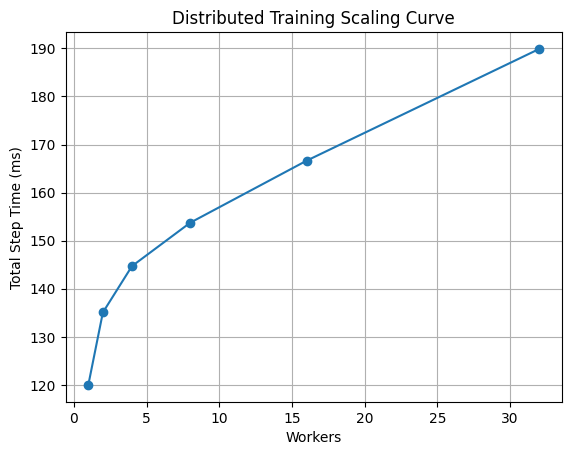
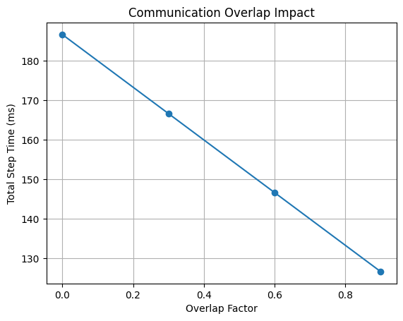
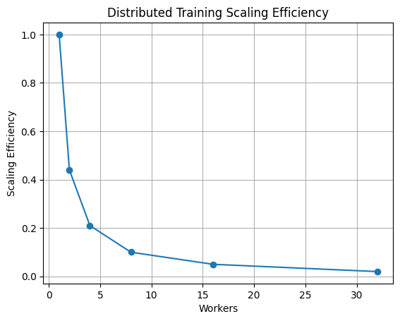

<div align="center">

# Distributed Training Profiler
### A systems-oriented profiler for analyzing communication, memory, and scaling bottlenecks in distributed machine learning training.


</div>

---

## Motivation

Modern large-scale training systems are increasingly constrained by:

- Communication overhead
- GPU memory limits
- Scaling inefficiencies
- Synchronization bottlenecks

Understanding these trade-offs is critical for:

- Distributed deep learning
- LLM training
- Systems optimization
- Infrastructure planning

This project simulates and analyzes distributed training behavior through a systems lens.

---

## Architecture

<p align="center">
  
</p>

---

## Quick Demo

```bash
dist-profiler --workers 8 --model-size 13
```

---

## Example Output

```text
Distributed Training Profiler
==================================================

Training Step Analysis
--------------------------------------------------
Workers: 8
Compute Time: 120.00 ms
Communication Time: 31.09 ms
Total Step Time: 141.76 ms
Communication Ratio: 0.15
Bottleneck: compute-bound

Memory Analysis
--------------------------------------------------
Model Size: 13.0B parameters
Parameter Memory: 24.21 GB
Gradient Memory: 24.21 GB
Optimizer Memory: 48.43 GB
Activation Memory: 36.32 GB
Total Memory: 133.18 GB

GPU Fit Analysis
--------------------------------------------------
GPU Memory: 80.00 GB
Fits on GPU: NO
Memory Utilization: 1.66x

ZeRO Memory Optimization
--------------------------------------------------
Baseline Memory: 133.18 GB
ZeRO-1 Memory:  90.80 GB
ZeRO-2 Memory:  69.62 GB
ZeRO-3 Memory:  48.43 GB
```

---

## Scaling Analysis

### Distributed Training Scaling Curve

<p align="center">
  
</p>

This benchmark demonstrates how communication overhead increasingly impacts total training step time as worker count grows.

---

### Communication Overlap Impact

<p align="center">
  
</p>

Increasing communication-computation overlap reduces effective synchronization overhead and improves distributed efficiency.

---

### Scaling Efficiency

<p align="center">
  
</p>

Scaling efficiency degrades as synchronization and communication costs dominate training.

---

## Features

- Ring all-reduce communication simulation
- Distributed training step modeling
- Communication vs compute bottleneck analysis
- Scaling efficiency estimation
- Communication-computation overlap simulation
- Memory estimation for large models
- GPU-fit feasibility analysis
- ZeRO-1 / ZeRO-2 / ZeRO-3 memory optimization modeling
- Scaling sweep benchmarks
- Scaling curve visualization

---

## Communication Model

The profiler models distributed communication using:

- Ring all-reduce approximation
- Bandwidth cost
- Latency cost
- Communication-computation overlap

Approximation:

```text
AllReduce Time ≈ Bandwidth Term + Latency Term
```

---

## Memory Model

The profiler estimates:

- Parameter memory
- Gradient memory
- Optimizer state memory
- Activation memory
- Total training memory

This enables analysis of large-model training feasibility and hardware constraints.

---

## ZeRO Optimization Simulation

The project models:

- ZeRO-1 → optimizer sharding
- ZeRO-2 → optimizer + gradient sharding
- ZeRO-3 → optimizer + gradient + parameter sharding

Example:

```text
13B model training

Baseline: 133 GB
ZeRO-1:   90 GB
ZeRO-2:   69 GB
ZeRO-3:   48 GB
```

---

## Installation

```bash
pip install -e .
```

---

## Usage

### Run profiler

```bash
dist-profiler --workers 16 --model-size 13
```

### Run scaling sweep

```bash
python examples/scaling_sweep.py
```

### Generate scaling plot

```bash
python examples/plot_scaling.py
```

### Run overlap analysis

```bash
python examples/overlap_sweep.py
```

---

## Repository Structure

```text
dist_profiler/
├── simulation/
│   ├── all_reduce.py
│   └── training_step.py
│
├── analysis/
│   ├── bottleneck.py
│   ├── memory.py
│   └── zero.py

examples/
├── scaling_sweep.py
├── overlap_sweep.py
├── plot_scaling.py
├── plot_overlap.py
└── plot_efficiency.py
```

---

## Key Insights

- Communication overhead grows with worker count
- Overlap reduces effective communication cost
- Large-model training quickly becomes memory-bound
- ZeRO sharding dramatically reduces memory requirements
- Scaling efficiency degrades as synchronization overhead increases

---

## Roadmap

- [ ] FSDP simulation
- [ ] Pipeline parallelism modeling
- [ ] Activation checkpointing simulation
- [ ] Network topology awareness
- [ ] Multi-node communication modeling
- [ ] Interactive visualization dashboard

---

## Limitations

- Simplified analytical model
- Does not execute real distributed workloads
- Communication model is approximate
- No hardware-specific kernel modeling

---

## Why This Matters

Large-scale ML training is fundamentally a systems problem.

This project explores how:

- Communication impacts scalability
- Memory limits affect feasibility
- Optimization strategies change system behavior

---

<div align="center">

*Omprakash Sahani — ML Systems Engineer (Distributed Training · Optimization · Systems)*

</div>